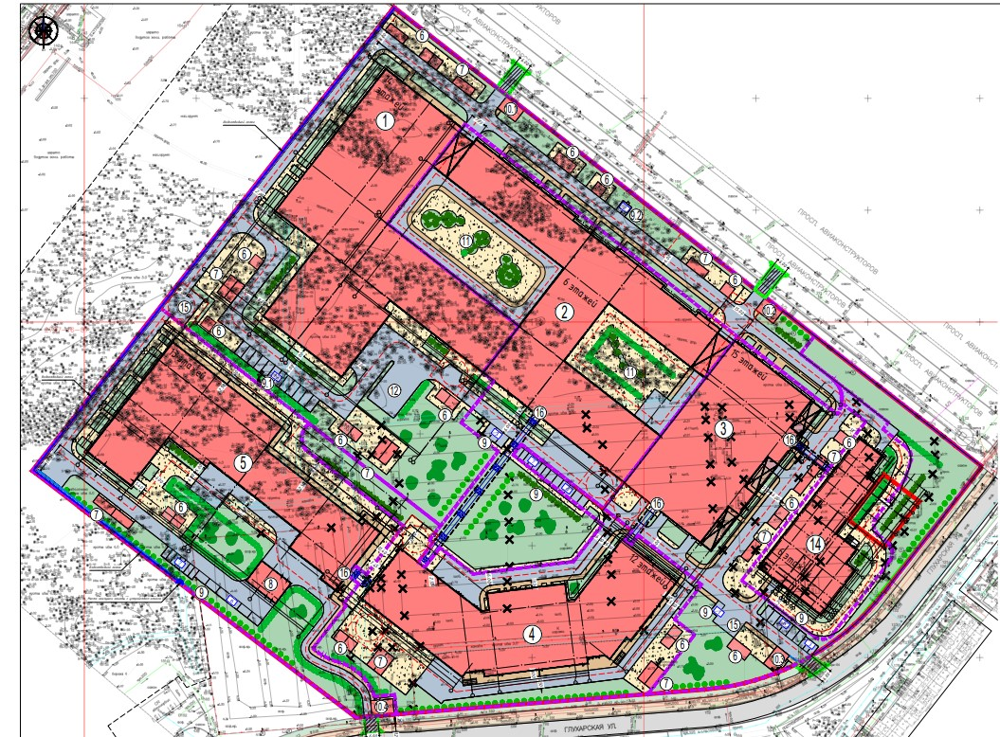

<h1 align="center">Hi there, I'm Samir Shibliev</a> 
</h1>
<h3 align="center">I am a BIM Coordinator and Plug-ins developer for Revit and Navisworks</h3>

1. [Project coordination](#project-coordination) 
2. [Plug-ins development](#plug-ins-development)
3. [Certificates](#certificates)

## Project coordination
### Multifunctional medical complex (Saint Petersburg)
A multifunctional medical complex is being developed, comprising five buildings, an [above-ground parking facility](#above-ground-parking-facility), and a vehicle processing station.

* [Building 1](#adult-inpatient-facility-with-240-beds) will house an adult inpatient facility with 240 beds, including an admission and diagnostic unit.
* [Building 2](#medical-diagnostic-facility-with-an-outpatient-consultation-department) is designed as a medical-diagnostic facility with an outpatient consultation department.
* [Building 3](#adult-inpatient-facility-with-360-beds) will be another adult inpatient facility, offering 360 beds.
* Building 4 is dedicated to pediatric care.
* Building 5 will serve as an infectious disease and pediatric care unit.

Currently, the designs for the first two buildings have been developed and approved, while the remaining projects are still in progress.

### Adult inpatient facility with 240 beds

[//]: # ()

**Duties and Responsibilities:**
* Structural model coordination with other disciplines
* Reviewing day to day updates in the structural model and reporting to BIM Manager
* Conducted quality assurance and quality control checks on model
* Helping engineers with Revit
* Preparing and exporting model to IFC

### Medical-diagnostic facility with an outpatient consultation department

**Duties and Responsibilities:**
* Structural model coordination with other disciplines
* Reviewing day to day updates in the structural model and reporting to BIM Manager
* Running and updating clash tests for daily clash reports
* Conducted quality assurance and quality control checks on model
* Helping engineers with Revit
* Preparing and exporting model to IFC

### Adult inpatient facility with 360 beds

**Duties and Responsibilities:**
* Structural model coordination with other disciplines
* Reviewing day to day updates in the structural model and reporting to BIM Manager
* Running and updating clash tests for daily clash reports
* Conducted quality assurance and quality control checks on model
* Helping engineers with Revit
* Preparing and exporting model to IFC

### Above-ground parking facility

**Duties and Responsibilities:**
* Structural model coordination with other disciplines
* Reviewing day to day updates in the structural model and reporting to BIM Manager
* Modeling of outdoor metal fire escape
* Conducted quality assurance and quality control checks on model
* Helping engineers with Revit
* Preparing and exporting model to IFC

## Plug-ins development

I have created a plugin that automates the export of RVT files to NWC, addressing the reliability issues associated with Navisworks Batch Utility, which often fails to produce consistent exports.

This plugin has been tested on a [multifunctional medical complex project](#multifunctional-medical-complex-saint-petersburg) and successfully updates NWC models 90% of the time, ensuring accurate clash detection in Navisworks.

To streamline this process, you can use the standard Windows Task Scheduler to configure the execution of a batch file, enabling systematic updates of files at designated times.

Additionally, I am developing a plugin for Navisworks that will automate the generation of reports. This tool operates similarly, employing a batch file that can be scheduled to run at a specific time.

The plugin will replicate the typical user actions required to generate a report, following this sequence used in the company:

* Opening the NWF model file with updated NWC files
* Hiding all elements in the "Hide" search set, updating checks
* Saving the NWF file, saving the NWD report file with the current date
* Generating an XML report file with the date included.

This enhancement will greatly accelerate the reporting process, especially beneficial for our branch in Novosibirsk, which is four hours ahead of our main office. Currently, designers there receive reports only in the middle of their workday. With this plugin, reports can be scheduled for generation before their workday begins.

I also create plugins for Revit to enhance and optimize workflows. For instance, my Revit Tab examples include:

A method to swiftly open projects from Revit Server into memory (making them invisible to the user), allowing for subsequent modifications or data extraction. Most buttons trigger a window displaying a tree structure of the Revit Server, where users can select a file.

This approach is employed, for example, in the export to IFC. After file selection, a window appears where users can specify export settings, including IFC version, coordinate base, level of detail, and parameter mapping tables.
Other export settings default to the company’s established standards.

My latest plugin release, "Color Filters," enables users to create colored filters on views based on the values of selected parameters within chosen categories.

<table>
<tr>
<td>

</td>
<td width="100">

    
    
To remove filters, click on the appropriate button

</td>
</tr>
</table>

## Certificates

